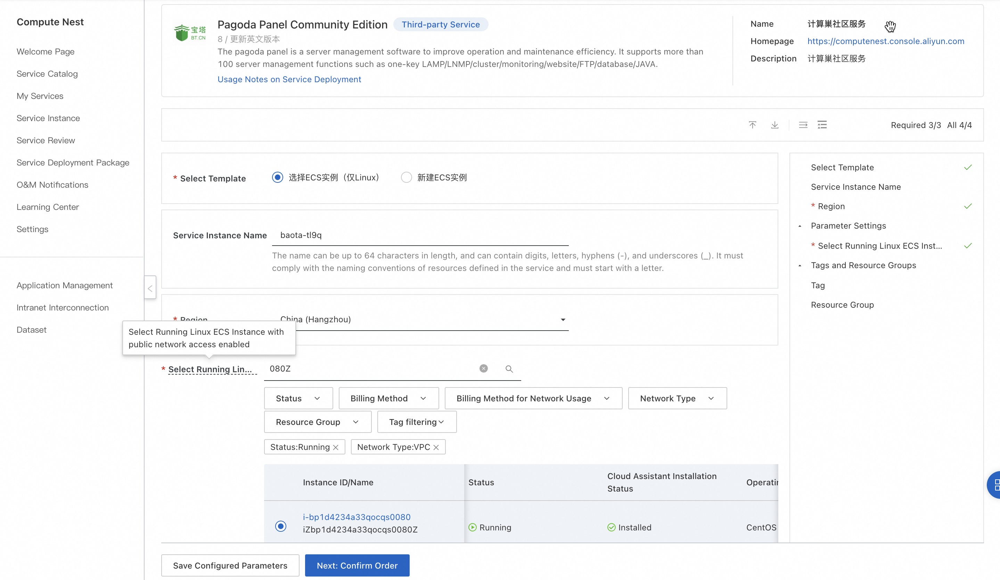
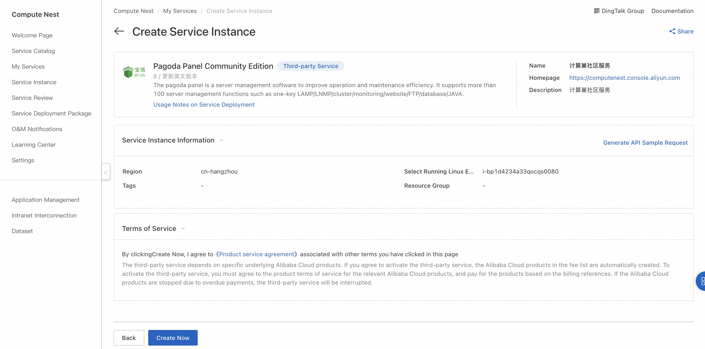
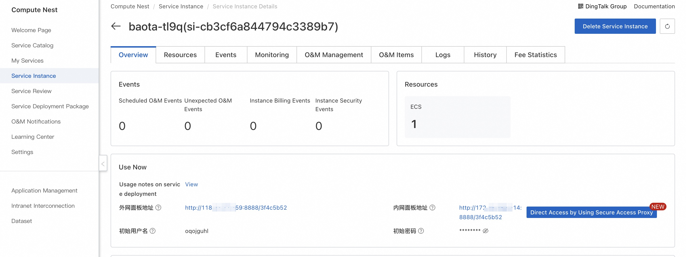
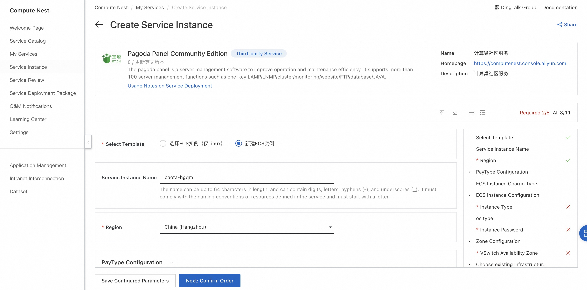
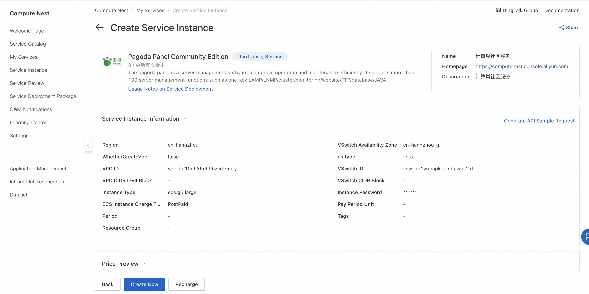

<h1> Quickly deploy the pagoda O & M panel </h1>

<h2> Overview </h2>

 pagoda operation and maintenance panel is a server management software to improve operation and maintenance efficiency. it supports more than 100 server management functions such as one-key LAMP/LNMP/cluster/monitoring/website/FTP/database/JAVA. 

 Pagoda Panel Official Website:<a href = "https://www.bt.cn">https://www.bt.cn</a>

 This service supports deployment on existing ECS instances (Linux) and deployment on new ECS instances (Linux or Windows). 

<h2> Billing instructions </h2>

 The cost of the pagoda Linux panel on the computing nest mainly involves:

<ul>
<li> Selected vCPU and Memory Specifications </li>
<li> Disk capacity </li>
<li> Internet bandwidth </li>
</ul>

 Billing method: Pay-as-you-go (hourly)

 The estimated cost is visible in real time when the instance is created. 

<h2> Deployment Architecture </h2>

 Pagoda Linux Panel Community Edition is a stand-alone deployment architecture. 

<h2> Permissions required for RAM accounts </h2>

 The pagoda panel service needs to access and create resources such as ECS and VPC. If you use a RAM user to create a service instance, you need to add the corresponding resource permissions to the account of the RAM user before creating the service instance. For more information about how to add RAM permissions, see <a href = "https://help.aliyun.com/document_detail/121945.html"> Authorize RAM users </a>.
. The required permissions are shown in the following table. 

<table>
<thead>
<tr>
<th> Permission policy name </th>
<th> Remarks </th>
</tr>
</thead>
<tbody>
<tr>
<td>AliyunECSFullAccess</td>
<td> Permissions to manage ECS </td>
</tr>
<tr>
<td>AliyunVPCFullAccess</td>
<td> Permissions for managing VPC networks </td>
</tr>
<tr>
<td>AliyunROSFullAccess</td>
<td> Manage permissions for Resource Orchestration Services (ROS) </td>
</tr>
<tr>
<td>AliyunComputeNestUserFullAccess</td>
<td> Manage user-side permissions for the compute nest service (ComputeNest) </td>
</tr>
<tr>
<td>AliyunCloudMonitorFullAccess</td>
<td> Permissions to manage CloudMonitor (CloudMonitor) </td>
</tr>
</tbody>
</table>

<h2> Select ECS instance deployment </h2>

 Select ECS instance deployment to support Linux OS. 

<h3> Prerequisites </h3>

<ol>
<li> The selected ECS instance can access the Internet and the security group has opened the 8888 port. </li>
<li> The selected ECS instance has not been installed in other environments such as Apache/Nginx/php/MySQL </li>
<li> System compatibility: Centos7.x/Alibaba Cloud Linux2 > Debian10 > Ubuntu 20.04 > Centos8 stream/Alibaba Cloud Linux3 > Ubuntu 18.04</li>
</ol>

<h3> Operation steps </h3>

<ol>
<li> Click <a href = "https://computenest.console.aliyun.com/service/instance/create/cn-hangzhou?type=user&ServiceId=service-8b13e60726a64ffbabc9"> Deployment Link </a> to go to the Service Instance Deployment page. </li>
<li> Select the target ECS instance and click Next: Confirm Order.
</li>
<li> Click Create Now and wait for the service instance to be created.
</li>
<li> After the service instance is created, go to the service instance details page. The login information of the pagoda panel can be obtained on the overview page.
</li>
<li> click the address of the external network panel to log in to the pagoda panel.
</li>
</ol>

<h2> Create ECS instance deployment </h2>

 New ECS instances support Linux and Windows operating systems. 

<h3> Operation steps </h3>

<ol>
<li> Click <a href = "https://computenest.console.aliyun.com/service/instance/create/cn-hangzhou?type=user&ServiceId=service-8b13e60726a64ffbabc9"> Deployment Link </a> to go to the Service Instance Deployment page. </li>
<li> Select the new ECS instance and configure the parameters according to the interface prompts. After the configuration is complete, click Next: Confirm Order.
</li>
<li> Click Create Now and wait for the service instance to be created.
</li>
<li> After the service instance is created, go to the service instance details page. On the overview page, you can obtain the login information of the pagoda panel. Click the address of the external network panel to log in to the pagoda panel.
</li>
</ol>
