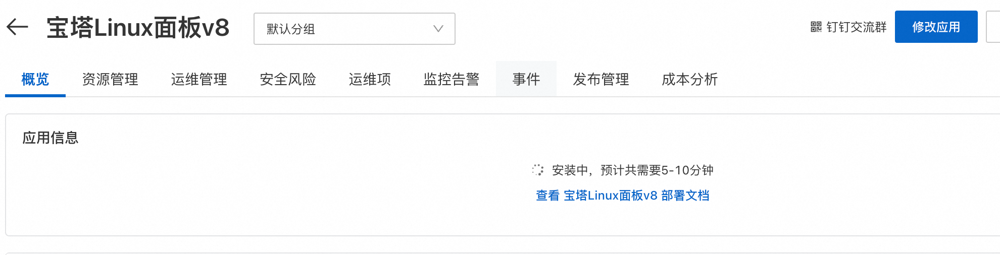
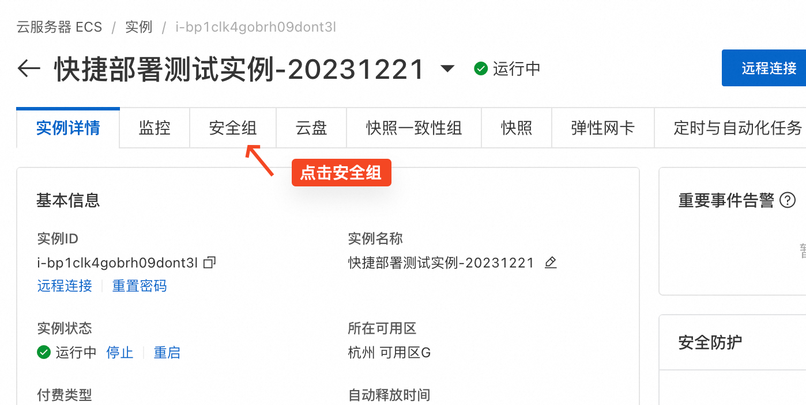
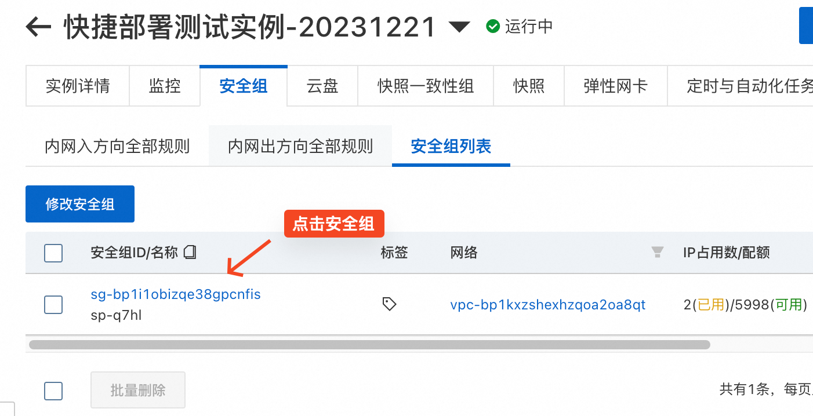
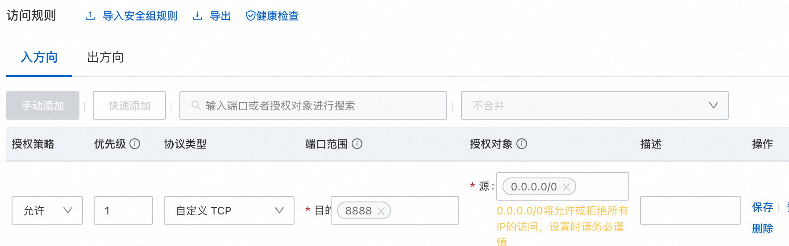

# 快捷部署单机应用 - 宝塔Linux面板

应用管理支持快捷部署常见单机应用。用户只需要选择应用和一台符合条件的ECS实例即可一键部署应用。
用户可以在应用分组概览页查看软件安装状态。在安装完成后，您可以在概览页查看应用的详情，比如访问地址和初始的用户名。

部署此应用不需要额外费用。

## 应用详情

宝塔Linux面板v8将在ECS实例上安装宝塔Linux面板v8.0.4官方版本。宝塔Linux面板是提升运维效率的服务器管理软件，支持一键LAMP/LNMP/集群/监控/网站/FTP/数据库/JAVA等100多项服务器管理功能。

宝塔Linux面板官方网站：[https://www.bt.cn](https://www.bt.cn)

## 部署前提条件

1. 为了保证安装成功，ECS实例的操作系统必须为以下类型，按兼容性排序：Centos7.x/Alibaba Cloud Linux2 > Debian10 > Ubuntu 20.04 > Centos8 stream/Alibaba Cloud Linux3 > Ubuntu 18.04。
2. ECS实例需要有公网IP，且在运行中状态。
3. 安装前请确保是全新的机器，没有安装其他任何环境，否则会影响您的业务使用。

## 部署时间

部署过程中需要从公网下载软件，根据您的ECS实例的带宽，可能需要5-10分钟。
  

在应用信息里看到宝塔的登录信息代表已经安装完成。
  

## 如何使用

宝塔Linux面板使用8888端口，您需要在ECS实例的安全组里放行入方向访问8888端口，才可以从公网访问。

操作步骤如下：

- 在应用的资源管理页，点击ECS实例ID进入ECS实例详情页
  
  

- 找到ECS实例关联的安全组
  
  

- 进入安全组
  
  

- 添加并保存允许入方向访问8888端口的规则
  
  

部署完成后，在应用的概览->应用信息里，可以查看宝塔Linux面板的外网面板地址和初始用户名、密码。点击外网面板地址后即打开宝塔登录页面，输入初始用户名和密码即可登录使用。
